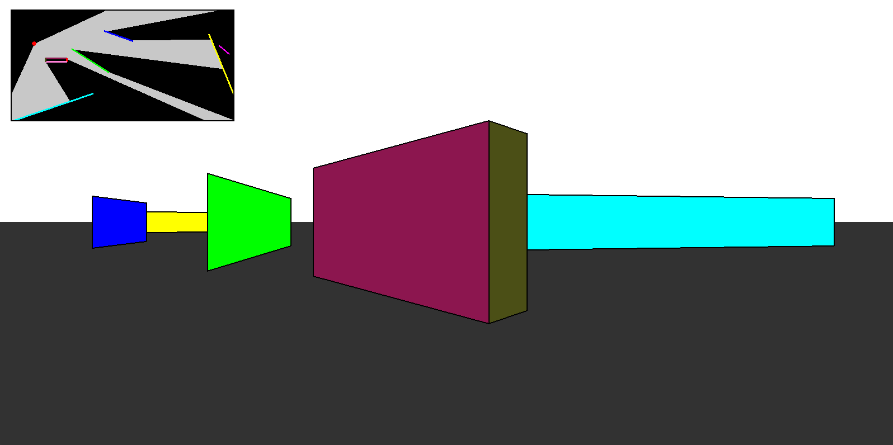

# Simple_Ray_Tracing
A simple demonstration of using ray tracing to display a POV from a 2D map (inspired by Doom)

# Controls
- **WASD:** move around
- **Left and Right Arrows:** look to the left or right
- **Space Bar:** generate a new random set of walls
  

